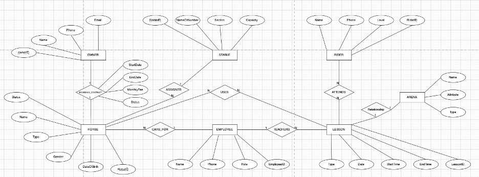
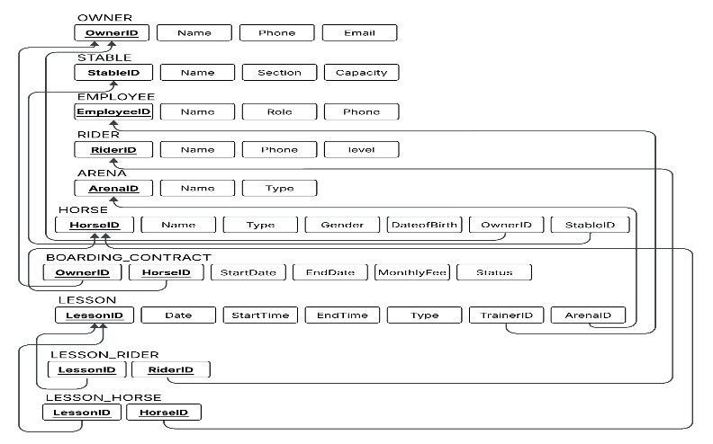
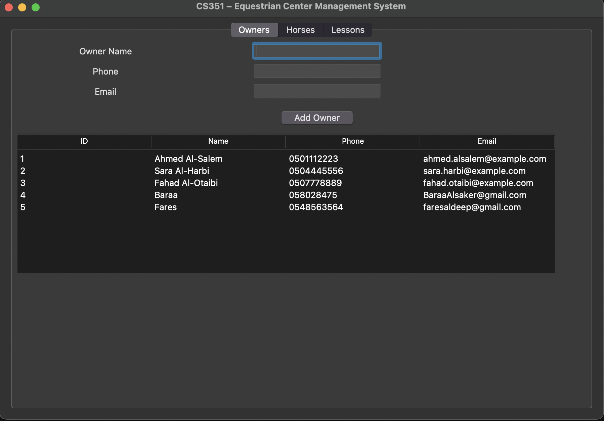
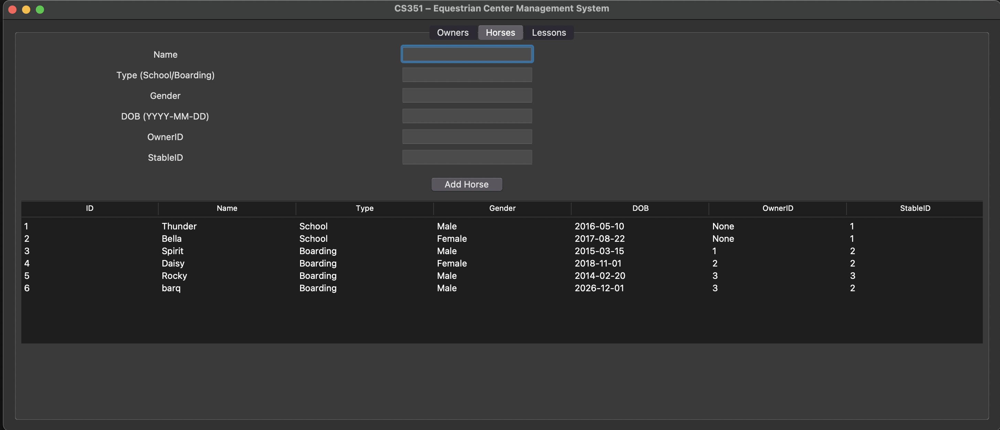
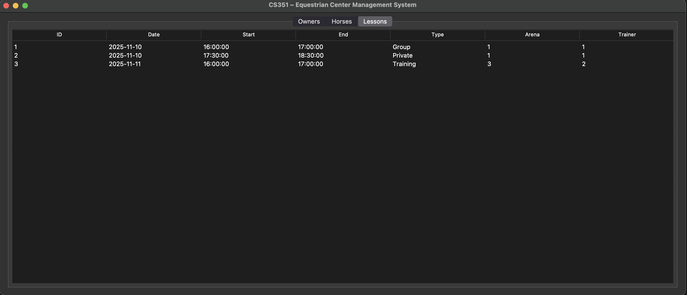

# 🐎 Equestrian Center Management System

> A full relational database application for managing horses, owners, employees, riders, lessons, arenas, grooming assignments, and boarding contracts in an equestrian center.

---

## 📖 Overview

The **Equestrian Center Management System** is a database-driven application designed to support the daily operations of an equestrian center in a structured and reliable way.

This project was developed for **CS351 – Fundamentals of Database Systems** and demonstrates the full database development lifecycle, including:

* requirement analysis
* conceptual design
* relational schema design
* SQL implementation
* business rule enforcement
* desktop interface development

The system combines a **MySQL relational database** with a **Python Tkinter GUI**, allowing users to manage core entities and retrieve organized information through a simple desktop application.

---

## ✨ Key Features

* 🐴 Manage horse records, including **School** and **Boarding** horses
* 👤 Store and manage owner information
* 👨‍🏫 Manage employees such as trainers and grooms
* 🧑‍🎓 Store rider information and lesson participation
* 🏟️ Organize arenas and lesson schedules
* 📅 Prevent overlapping lessons in the same arena
* 🚫 Prevent trainer schedule conflicts
* 🏠 Enforce stable capacity limits
* 📄 Track boarding contracts and prevent overlapping active contracts
* 🧹 Assign grooms to horses with validation rules
* 📊 Simplify reporting through SQL views
* 🖥️ Interact with the database through a desktop GUI

---

## 🏗️ System Architecture

This project is organized into two main layers:

### 🗄️ Database Layer

Implemented in **MySQL**, including:

* relational schema
* primary and foreign keys
* constraints (`PRIMARY KEY`, `FOREIGN KEY`, `UNIQUE`, `CHECK`, `NOT NULL`)
* triggers for business rule enforcement
* views for easier reporting
* sample data for testing and demonstration

### 💻 Application Layer

Implemented in **Python** using **Tkinter**, including:

* owner management
* horse management
* lesson viewing
* database connection through `mysql-connector-python`

---

## 📁 Project Structure

```bash
equestrian-center-management-system/
│
├── app/
│   ├── main.py
│   └── db.py
│
├── database/
│   └── schema.sql
│
├── screenshots/
│   ├── er-diagram.png
│   ├── relational-schema.png
│   ├── gui-owners.png
│   ├── gui-horses.png
│   └── gui-lessons.png
│
├── requirements.txt
└── README.md
```

---

## 🧠 Database Design Highlights

The system was designed to model the real-world operations of an equestrian center using a normalized relational structure.

### Main Entities

* `OWNER`
* `HORSE`
* `EMPLOYEE`
* `RIDER`
* `STABLE`
* `ARENA`
* `LESSON`
* `BOARDING_CONTRACT`
* `LESSON_RIDER`
* `LESSON_HORSE`
* `HORSE_GROOM_ASSIGNMENT`

### Design Goals

* maintain **data integrity**
* reduce **redundancy**
* enforce **business constraints**
* support **efficient retrieval**
* provide a clear mapping from ER design to relational schema

---

## 🛡️ Business Rules Enforced

A major strength of this project is that important rules are enforced directly at the **database level**, not only in the application.

Examples include:

* School horses must **not** have an owner
* Boarding horses must **have** an owner
* Stable capacity cannot be exceeded
* Only employees with role **Trainer** can teach lessons
* Only employees with role **Groom** can be assigned as grooms
* Lesson times must be valid
* Arena bookings cannot overlap
* Trainer schedules cannot overlap
* A horse cannot have overlapping active boarding contracts
* A horse cannot have overlapping groom assignments

This makes the system more reliable and closer to real-world database design practices.

---

## 👨‍💻 Technologies Used

* **MySQL**
* **Python**
* **Tkinter**
* **mysql-connector-python**

---

## 🚀 How to Run the Project

### 1️⃣ Clone the repository

```bash
git clone https://github.com/BaraaAlsaker/Equestrian-Center-Management-System.git
cd Equestrian-Center-Management-System
```

### 2️⃣ Install the required package

```bash
pip install -r requirements.txt
```

If you do not use `requirements.txt`, install manually:

```bash
pip install mysql-connector-python
```

### 3️⃣ Create the database

Open MySQL and run the SQL script inside:

```text
database/schema.sql
```

This script will:

* create the database
* create all tables
* apply constraints and triggers
* create views
* insert sample data

### 4️⃣ Update the database connection settings

Open:

```text
app/db.py
```

Replace the placeholders with your own MySQL credentials:

```python
def get_connection():
    return mysql.connector.connect(
        host="localhost",
        user="YOUR_USERNAME",
        password="YOUR_PASSWORD",
        database="CS351_EquestrianCenter"
    )
```

### 5️⃣ Run the application

```bash
python app/main.py
```

---

## 🖼️ Screenshots

### Entity-Relationship Diagram



### Relational Schema



### Owners Interface



### Horses Interface



### Lessons Interface



---

## 📌 Example Functionalities

The system supports operations such as:

* adding and viewing owners
* adding and viewing horses
* viewing lesson schedules
* validating lesson conflicts
* checking boarding contract rules
* retrieving active or expiring contracts through views
* organizing relationships between riders, horses, and lessons

---

## 📊 Learning Outcomes

This project demonstrates practical understanding of:

* relational database design
* ER modeling
* normalization
* SQL DDL and DML
* integrity constraints
* triggers and views
* Python database connectivity
* desktop application integration with databases

---

## 🔮 Future Improvements

Possible extensions for this project include:

* adding update and delete operations in the GUI
* improving the interface design
* adding authentication and user roles
* adding financial and payment management
* adding notification support for expiring contracts
* deploying the system in a multi-user environment

---

## 👥 Team

* **Baraa Alsaker**
* **Abdurahman Ghannam**
* **Abdulelah Sami**

---

## 🎓 Course Information

**CS351 – Fundamentals of Database Systems**
College of Computer and Cyber Sciences
University of Prince Mugrin

---

## ⭐ Final Note

This project was built as a complete academic database application and presented as a portfolio-ready system to demonstrate practical database design and implementation skills.
